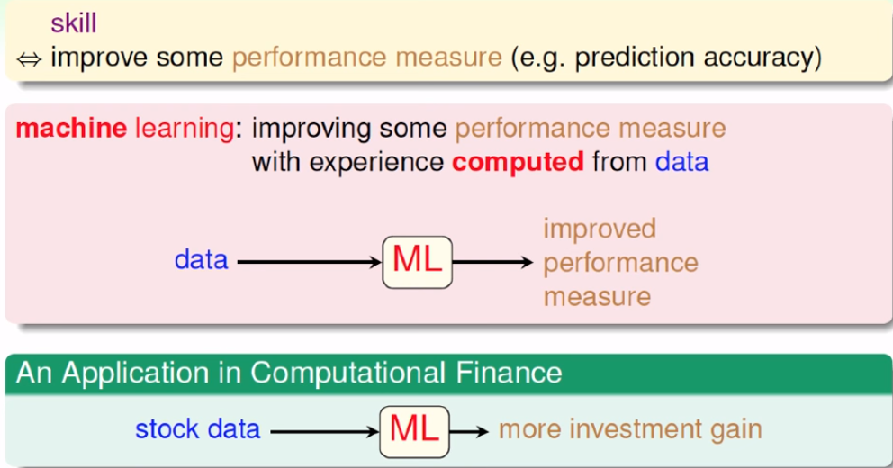
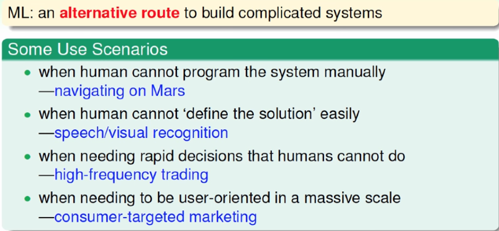
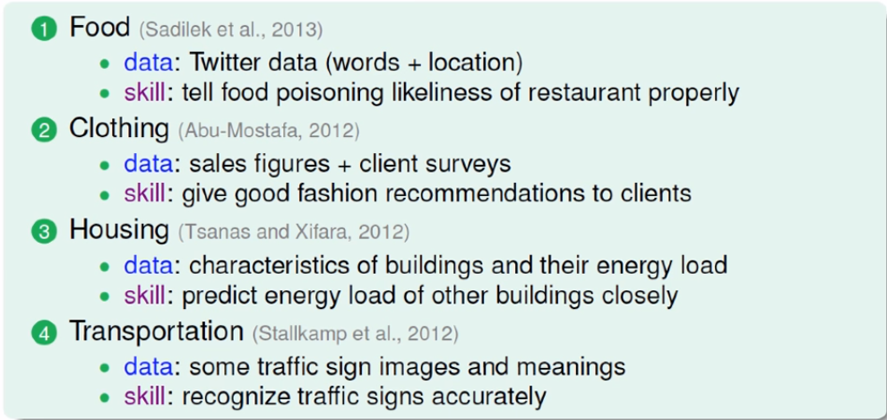
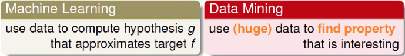
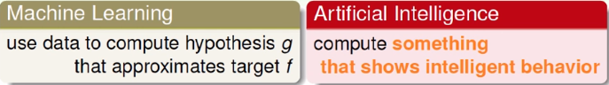
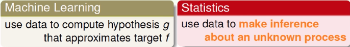

> 课程内容来自于国立台湾大学-林轩田-機器學習基石
>
> 视频内容 [機器學習基石](https://www.youtube.com/playlist?list=PLXVfgk9fNX2I7tB6oIINGBmW50rrmFTqf)，图片内容来源于视频课件

<!--more-->

基本架构：

- When Can Machines Learn?
- Why Can Machines Learn?
- How Can Machines Learn?
- How Can Machines Learn **Better**?

## 什么是机器学习

**机器学习**：我们用电脑来模仿人学习的过程（通过观察经过一番处理变成有用的技巧）

**技巧**：增进某一种表现

## 为什么使用机器学习？

例子：如何辨识一棵树？

- 通过观察很多的树得到技巧（辨识树）

机器学习是取代复杂系统的一种方式

机器学习的三个关键

- 要有表现可以增进（有一些模式可以被学习）
- 没有程序化的定义
- 有关于这个模式的数据

## 机器学习的应用

例：我们如何确定会不会喜欢一部电影

- 观看者描述为一串数字（对于各类电影的喜好）
- 电影也描述为一串数字（表示是何种类型的电影）
- 作内积，看结果的大小表示是否吻合
- 从这些rating反推电影和人的特征是什么

## 学习的组成部分

**基本符号**：

- 输入：$x \in \mathcal{X}$
- 输出：$y \in \mathcal{Y}$
- 目标函数：$f: \mathcal{X} \rightarrow \mathcal{Y}$
- 数据：$\mathcal{D} = $ { $(x_1,y_1),(x_2,y_2),...,(x_N,y_N) $ }
- 假说：$g:\mathcal{X} \rightarrow \mathcal{Y}$
- 假说集：$g \in \mathcal{H} = $ { $h_k$ }
- 学习算法：$\mathcal{A}$
- 学习模型：$\mathcal{A}$ and $\mathcal{H}$

注意：

- 目标函数$f$是未知的
- $g \approx f$，但很有可能$f \neq g$

**机器学习**：从资料出发，计算出假说$g$，并且希望他很接近目标函数$f$

## 机器学习和相关领域

### 机器学习和数据挖掘

非常相似，取决于数据挖掘的目标是否与机器学习的假说相同

### 机器学习和人工智能

- 机器学习是实现人工智能的一种方法

### 机器学习和统计

- 统计是实现机器学习的一种方法
- 统计学会专注于数学上的推论
