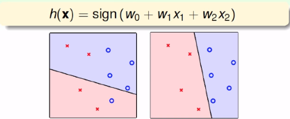
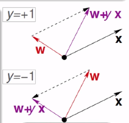
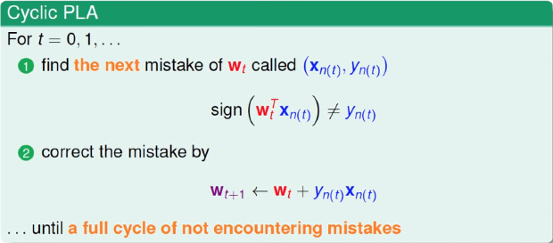
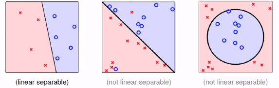
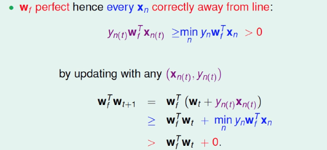
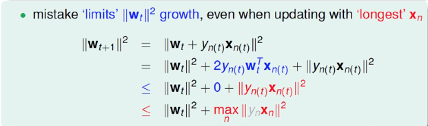
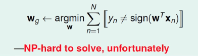
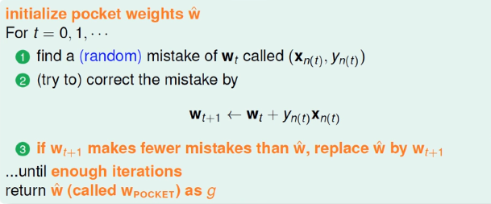

> 课程内容来自于国立台湾大学-林轩田-機器學習基石
>
> 视频内容 [機器學習基石](https://www.youtube.com/playlist?list=PLXVfgk9fNX2I7tB6oIINGBmW50rrmFTqf)，图片内容来源于视频课件

<!--more-->

**机器如何学会说是还是否**

## 感知器

例：要不要给一个用户信用卡：

- $x =(x_1,x_2,...,x_d)$ 表示用户的特征，计算出一个权重

- 如果$\sum \limits_{i=1}^{d} w_Ix_i>$ threshold 就给信用卡

- $\mathcal{Y}$ : {$+1(good),-1(bad)$}，0 ignored

  $$h(x) = sign((\sum \limits_{i=1}^dw_ix_i) - threshold)$$

- $h(x)$ 是感知器（Perceptron）

二维情况：

也称为**线性分类器**

## 感知器学习算法

- 在$\mathcal{H}$中找到$g$使得：

$$g(x_n) = f(x_n) = y_n$$

- 这不是一件容易的事情，因为有无数条可能的直线

- 思路：

  - 我们从$g_0$开始
  - 修正这条直线
  - 直到我们觉得这条线足够好

- 具体实现：

  - 在每一轮中都做如下步骤

  - 找到犯错的$w_t$：$(x_{n(t)},y_{n(t)})$

    $$sign(W_t^ \mathrm{T}x_{n(t)}) \neq y_{n(t)}$$

  - 修正错误：

    $$W_{t+1} = W_t + y_{n(t)}x_{n(t)}$$

    

  - 直到不再犯错

  - 返回$W_{PLA}$

PLA指的是Perceptron Learning Algorithm

一种常见的PLA的实现方法：

问题：PLA算法是不是一定会终止？终止的时候$g \approx f$？

## 线性可分(Linear Separability)

 

线性可分等价于存在$W_f$使得$y_n = sign(W_f^ \mathrm{T} x_n)$

上面的过程说明了向量的内积原来越大，但是在计算的过程中尚未解决向量长度的问题，因此内积的增大并不一定等价于两者越来越接近。其中第一个式子表示理想的$W_f$能够准确的判别每一个点，因此在我们犯错的点也可以正确的判别。

后面的过程需要用到我们的更新条件：

$$sign(W_t^\mathrm{T}x_{n(t)}) \ne y_{n(t)} \Leftrightarrow y_{n(t)}W_t^\mathrm{T}x_{n(t)} \le 0$$

如果我们从$W_0 = 0$开始，在经过了$T$次的错误修正后，存在下面的不等式：

$$\frac{W_f^\mathrm{T}}{||W_f||} \frac{W_T}{||W_T||} \ge \sqrt{T} \cdot constant $$

所以**PLA一定会停止**

## 更多关于PLA

- 优点

  可以在任何维度进行计算

- 缺点

  - 需要先假设是线性可分的
  - 就算知道是线性可分的，不知道多久会停止

如果我们的资料不是线性可分的？

## 对于有噪声的数据

- 首先假设噪声是小的

- 如果这样，$g \approx f \Leftrightarrow y_n = g(x_n)$

- 定义一个最好的函数：使得犯错误的情况最少

  

## 调整PLA算法（口袋演算法）

口袋演算法——Pocket Algorithm

