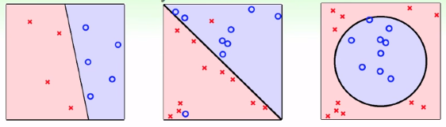
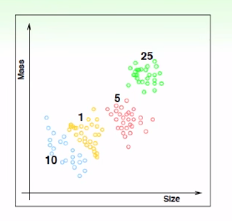
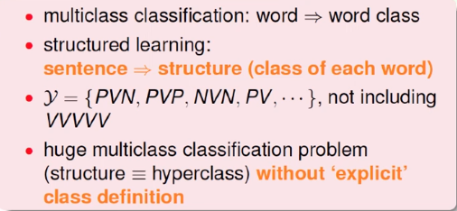
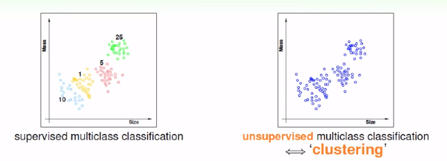
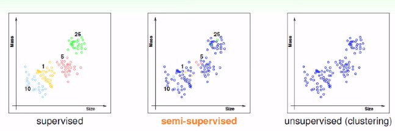

> 课程内容来自于国立台湾大学-林轩田-機器學習基石
>
> 视频内容 [機器學習基石](https://www.youtube.com/playlist?list=PLXVfgk9fNX2I7tB6oIINGBmW50rrmFTqf)，图片内容来源于视频课件

<!--more-->

各式各样的机器学习问题**

## 二元分类（是非题）

Binary Classification Problems

## 多分类问题

Multiclass Classification

> - 根据大小和重量判别硬币的种类
> - 判断写的数字
> - 根据图片判断水果种类
> - 给邮件分类（重要、社交、垃圾等等）

## 回归分析：病人的康复时间预测

- 二元分类：病人是否患病
- 多元分类：病人患病的种类
- 回归分析：病人康复的时间

## 结构学习：句子词性标注

## 在不同的输出空间上进行学习

- 二元分类：$\mathcal{Y} = $ {$-1,+1 $}
- 多元分类：$\mathcal{Y} =$  { $1,2,...,K$ }
- 回归分析：$\mathcal{Y} = \mathbb{R}$
- 结构学习：$\mathcal{Y} =$ 结构
- ……还有更多！

**核心工具：二元分类与回归分析**

## 监督学习与非监督学习

> 硬币分类问题中，有硬币的数据和硬币的种类，这就是监督学习
>
> 如果不告诉硬币的种类，就是非监督学习（同样可以进行学习——聚类）

### 非监督学习

- 聚类：不知道类别去进行分类
- 密度分析：判断点在哪些位置比较稠密，哪些位置比较稀疏
- 异常值检验：判断点集中的异常点
- ……还有更多！

## 半监督学习

> - Facebook添加脸部标签
> - 给药物的数据添加标签

## 强化学习

> 用奖励和惩罚来告诉算法是好还是不好
>
> 例子：
>
> - 线上广告系统
> - 牌类游戏（策略）

## 在不同的资料的标记中学习

- 监督学习：全部的$y_n$
- 非监督学习：没有$y_n$
- 半监督学习：部分的$y_n$
- 强化学习：辅助的$y_n$($\widetilde{y}_n$)

**核心方法：监督学习**

## 批量学习（Batch Learning）

**一次性批量输入**给学习算法

- 垃圾邮件的过滤器
- 癌症检测
- 病人的分批

## 在线算法（Online Learning）

**循序学习**，不断的修正算法，进行优化

PLA也可以以在线学习的方法呈现

强化学习通常是用在线算法实现

## 主动学习

机器有**问问题**的能力

机器在问问题的时候是有技巧的，有可能会使得算法的优化效率更高

## 不同的输入形式

- 具体的
- 原始的
- 抽象的

