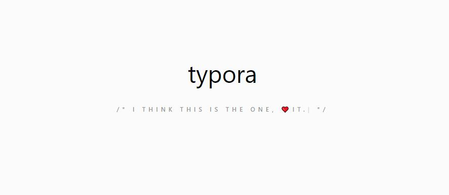
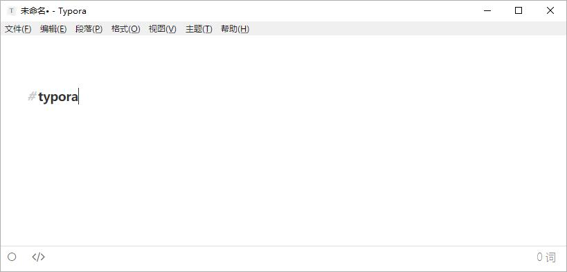
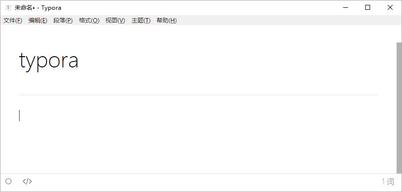
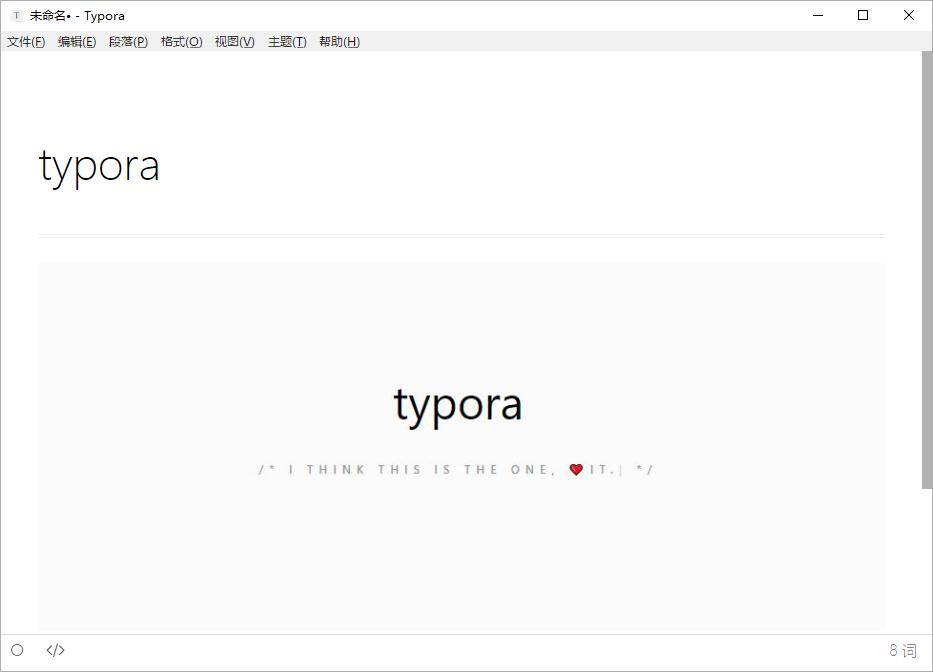
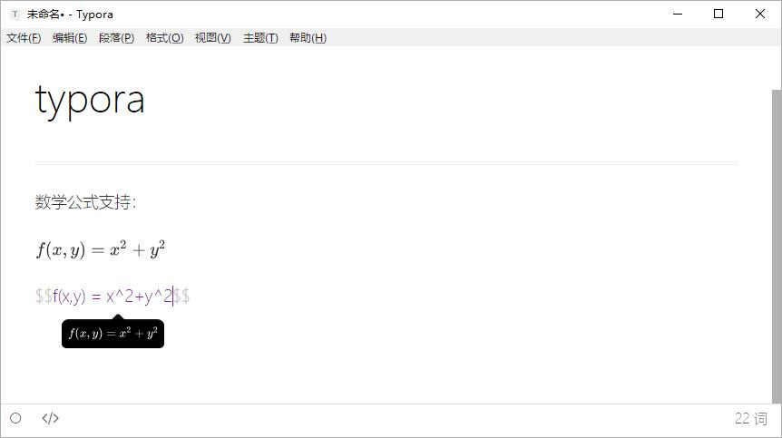

> 如果你喜欢「所见即所得」的视觉效果，如果你喜欢简洁的操作体验（比如拖拽添加图片），typora大概就是你想要的Markdown编辑器

<!--more-->

凡是用过Markdown的都会体会到Markdown的优势，为了排版你几乎不需要花费额外的时间，就可以得到还看得过去的排版结果（当然Markdown也有很多高端的玩法，之前就看到过用Markdown来排版论文的），并且相比于$\LaTeX$ 他的学习成本要低很多，因此对于大多数人来说，Markdown都是一个很好的选择。

不像Word只有Kingsoft和Microsoft两家可以选择，Markdown编辑器的选择就要多得多，并且各个编辑器的特性都略有不同，这里要推荐的就是从刚推出Beta版本就使用至今的 [typora](https://www.typora.io/) 。typora目前还在Beta阶段，并且是**免费**的，自Beta版本发布就有人说正式版发布将会变成收费软件，但是Beta版本发布至今也超过一年了，尚不知道什么时候会推出正式版本。

# 特性介绍

## 所见即所得

这是typora最大的特性，在双栏的设计铺天盖地的Markdown编辑器中，要找到一款所见即所得的实属不易，最初吸引我的就是这一个特性。之前也使用过很多Markdown的编辑器，包括*MarkdownPad*这样专门用于Markdown文件的编辑器和*Atom*, *Sublime*这类通过插件支持Markdown的编辑器，他们实现预览都是通过双栏实时预览，但是或多或少都存在着渲染比较卡顿的情况，一旦书写的文字较多，你都可以在预览的窗口看到明显的延迟。typora虽然在推出之初也存在着这样的问题，但是更新到现在的版本已经是相当流畅了。相比于其他的软件，typora给你的视觉体验更好，你在编辑器中几乎找不到Markdown的语法代码，一旦输入，typora就会进行实时渲染。

> 一旦输入完成，敲击回车或者方向下键，typora就会马上给你呈现最终的效果

## 图片插入

刚开始使用Markdown的用户最介意的可能就是Markdown在插入图片上的不方便，在Word上只需要通过简单的拖拽实现的插入过程，在Markdown中你甚至还需要输入图片的路径，给高效的输入带来了一定的阻碍。在typora中你需要做的，只是把图片拖到编辑框中。

> 将图片拖到编辑器中可以直接看到最终效果。

## $\LaTeX$的良好支持

作为一个$\LaTeX$的使用者，Markdown是要比$\LaTeX$更加简单快捷的，但是$\LaTeX$一个很大的优势就是数学公式的使用，在typora中你无需担心这一点，typora中的$\LaTeX$使用和在$\LaTeX$的编辑环境中完全相同，即使是在学术上的使用也完全不虚。

> 数学公式输入效果

## 文件导出

> 很多软件都将导出pdf文件作为软件的高级功能，只有收费才能实现，但是typora现阶段是完全免费的，并且也支持pdf的导出效果，第一次使用的时候会需要安装*Pandoc*，之后重启编辑器即可

## 快捷键

在typora中，你可以通过`Ctrl+1`来表示一级标题，同理`Ctrl+2`来表示二级标题，并且typora的高级设置中支持快捷键的自定义，对于习惯于使用快捷键的用户来说也是相当方便的。 

# 总结

相比于其他的编辑器，typora的最大优势在于**所见即所得，免费，对$\LaTeX$的良好支持**，在操作和视觉显示上他接近于Word，但是排版的美观程度又更贴近于$\LaTeX$的效果， 非常适合日常使用。